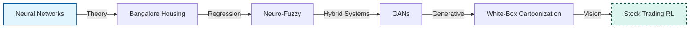
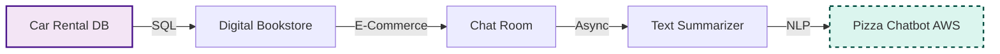
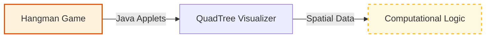

<div align="center">

  <a name="readme-top"></a>
  # [](https://www.researchgate.net/profile/Amey-Thakur) ResearchGate

  <a href="https://www.researchgate.net/profile/Amey-Thakur"></a>
  <a href="https://www.researchgate.net/profile/Amey-Thakur"></a>
  <a href="https://www.researchgate.net/profile/Amey-Thakur"></a>

  <br>

  [](LICENSE)
  
  [](https://github.com/Amey-Thakur/RESEARCHGATE)
  [](https://github.com/Amey-Thakur)

  An authoritative technical companion and scholarly archival mirror designed to synchronize functional implementations with research artifacts shared on the **ResearchGate** platform.

  **[Source Code](ResearchGate/)** &nbsp;·&nbsp; **[Technical Specification](docs/SPECIFICATION.md)** &nbsp;·&nbsp; **[ResearchGate Profile](https://www.researchgate.net/profile/Amey-Thakur)**

</div>

---

<div align="center">

  [Research Lab](#research-lab) &nbsp;·&nbsp; [Overview](#overview) &nbsp;·&nbsp; [Pathways](#learning-pathways) &nbsp;·&nbsp; [Structure](#project-structure) &nbsp;·&nbsp; [Project Catalog](#project-catalog) &nbsp;·&nbsp; [Usage Guidelines](#usage-guidelines) &nbsp;·&nbsp; [License](#license) &nbsp;·&nbsp; [About](#about-this-repository) &nbsp;·&nbsp; [Acknowledgments](#acknowledgments)

</div>

---


<!-- RESEARCH LAB -->
<a name="research-lab"></a>
## Scholarly Research Foundation

<div align="center">

  [](https://www.researchgate.net/lab/Amey-Thakur-Lab-4)

  ### **[Research Lab - Amey Thakur](https://www.researchgate.net/lab/Amey-Thakur-Lab-4)**
  *Focusing on Artificial Intelligence, Web Engineering, and Computational Design.*

  **Research Contributors**

| Contributor | Role | Profile & ORCID |
|:---|:---:|:---:|
| **Amey Thakur** | Principal Investigator | [Profile](https://www.researchgate.net/profile/Amey-Thakur) &middot; [](https://orcid.org/0000-0001-5644-1575) |
| **Mega Satish** | Principal Researcher | [Profile](https://www.researchgate.net/profile/Mega-Satish) &middot; [](https://orcid.org/0000-0002-1844-9557) |
| **Karan Dhiman** | Collaborator | [Profile](https://www.researchgate.net/profile/Karan-Dhiman-3) |
| **Hasan Rizvi** | Collaborator | [Profile](https://www.researchgate.net/profile/Hasan-Rizvi-8) |
| **Mayuresh Phansikar** | Collaborator | [Profile](https://www.researchgate.net/profile/Mayuresh-Phansikar) |
| **Archit Konde** | Collaborator | [Profile](https://www.researchgate.net/profile/Archit-Konde) |
| **Saakshi Deokar** | Collaborator | [Profile](https://www.researchgate.net/profile/Saakshi-Deokar) |

</div>

<br>

> [!NOTE]
> This repository functions as a deterministic technical archival mirror for scholarly implementations. It synchronizes functional research outputs with the academic artifacts shared across the global **[ResearchGate](https://www.researchgate.net/lab/Amey-Thakur-Lab-4)** network.

---

<!-- OVERVIEW -->
<a name="overview"></a>
## Overview

**ResearchGate (Technical Archival)** is a specialized scholarly companion architecture engineered to preserve, showcase, and mirror a diverse range of technical research projects linked to the ResearchGate network. By bridging the gap between theoretical system design and high-fidelity archival, this repository provides a foundational study into **Machine Learning**, **Computational Intelligence**, and **Applied Software Engineering**.

The repository functions as a deterministic technical corridor for complex algorithms and modern development frameworks, enabling high-performance research synchronization directly within a version-controlled environment.

### Scholarly Precision Pillars
The archival model is governed by strict **computational design patterns** ensuring fidelity and clarity:
*   **Archival Integrity**: Systematic documentation of technical reports, preprints, and peer-reviewed articles.
*   **Multi-Domain Synthesis**: Integration of varied research fields including Neural Networks, NLP, and Financial Optimization.
*   **Verification Standards**: Every project goal is coupled with functional code, demos, and scholarly artifacts for zero-latency proof.

> [!TIP]
> **Scholarly Precision Integration**
>
> To maximize academic value, the repository employs a **Formal Archival Strategy**. Each project contains its own **Technical Reports** and **Demos**, strictly coupling implementation results with peer-reviewed validation. This ensures that the research remains accessible and provides a high-fidelity reference for the engineering community.

---

<!-- LEARNING PATHWAYS -->
<a name="learning-pathways"></a>
## Systematic Learning Pathways

> [!NOTE]
> **Curriculum Roadmap**: This repository is structured as a **progressive computational curriculum**. Follow these verified pathways to master specific domains, moving from **Theoretical Foundations** to **Production-Grade Implementation**.

### **Track A: The AI Researcher**
*From Neural Foundations to Generative Deep Learning.*



### **Track B: The Full-Stack System Engineer**
*From Database Schemas to Cloud-Integrated Web Architecture.*



### **Track C: Algorithmic Logic & Visualization**
*Mastering Data Structures and Interactive Reasoning.*



---

<!-- STRUCTURE -->
<a name="project-structure"></a>
## Project Structure

```python
RESEARCHGATE/
│
├── docs/                                    # Project Documentation
│   └── SPECIFICATION.md                     # Technical Architecture
│
├── ResearchGate/                            # Primary Engineering Layer
│   ├── Bangalore House Price Prediction/    # ML: Price Forecasting
│   ├── CHAT ROOM USING HTML.../             # Web: Chat Engineering
│   ├── Car Rental Database System/          # Data: Schema Design
│   ├── Digital Bookstore/                   # Web: Bookstore Architecture
│   ├── Fundamentals of Neural Networks/     # AI: Core Theory & Implementation
│   ├── Generative Adversarial Networks/     # AI: GAN Research
│   ├── Hangman Word Game/                   # Logic: Applet Deduction
│   ├── Neuro-Fuzzy - Artificial.../         # AI: Hybrid Systems
│   ├── Pizza Ordering Chatbot.../           # AI: AWS Lex Interaction
│   ├── Text Summarizer Using Julia/         # NLP: High-Performance Summarization
│   ├── White-Box Cartoonization.../         # AI: Extended GAN Framework
│   └── ResearchGate.png                     # Branding Asset
│
├── CITATION.cff                             # Project Citation Manifest
├── codemeta.json                            # Metadata Standard
├── LICENSE                                  # CC BY 4.0 License
├── SECURITY.md                              # Security Protocols
└── README.md                                # Project Entrance
```

---


<a name="project-catalog"></a>
## Project Catalog

> [!IMPORTANT]
> Click on each section below to expand and view the curated research projects with direct access to technical documentation and scholarly articles.

<details>
<summary><strong>Hangman Word Game</strong><br><a href="https://www.researchgate.net/publication/354322708_Hangman_Word_Game"></a> <a href="https://www.researchgate.net/publication/354322708_Hangman_Word_Game"></a> <a href="https://www.researchgate.net/publication/354322708_Hangman_Word_Game"></a></summary>

- [x] **Project Goal**: Hangman Word Game using Applet in Java.

   * [Project](https://github.com/Amey-Thakur/RESEARCHGATE/tree/main/ResearchGate/Hangman%20Word%20Game) | [Web Application](https://amey-thakur.github.io/HANGMAN-WORD-GAME/)

     *  [GitHub Repository](https://github.com/Amey-Thakur/HANGMAN-WORD-GAME)
     *  [Published Article](https://www.researchgate.net/publication/354322708_Hangman_Word_Game) - [DOI](http://dx.doi.org/10.13140/RG.2.2.26806.22082)
     *  [Project Demo](https://www.researchgate.net/profile/Amey-Thakur/project/Hangman-Word-Game/attachment/6131017d647f3906fc9589bf/AS:1063634344091648@1630601597251/download/Applet.mp4?context=ProjectUpdatesLog)

 - Authors: Amey Thakur, Mega Satish & Saakshi Deokar

</details>

<details>
<summary><strong>Chat Room using HTML, PHP, CSS, JS, AJAX</strong><br><a href="https://www.researchgate.net/publication/352798946_CHAT_ROOM_USING_HTML_PHP_CSS_JS_AJAX"></a> <a href="https://www.researchgate.net/publication/352798946_CHAT_ROOM_USING_HTML_PHP_CSS_JS_AJAX"></a> <a href="https://www.researchgate.net/publication/352798946_CHAT_ROOM_USING_HTML_PHP_CSS_JS_AJAX"></a> <a href="https://www.researchgate.net/publication/352798946_CHAT_ROOM_USING_HTML_PHP_CSS_JS_AJAX"></a></summary>


- [x] **Project Goal**: Web-Based Chat Application using PHP, MySQL, JS, AJAX.

   * [Project](https://github.com/Amey-Thakur/RESEARCHGATE/tree/main/ResearchGate/CHAT%20ROOM%20USING%20HTML,%20PHP,%20CSS,%20JS,%20AJAX) | [Web Application](https://amey-thakur.github.io/CHAT-ROOM/)

     *  [GitHub Repository](https://github.com/Amey-Thakur/CHAT-ROOM)
     *  [Published Article](https://www.researchgate.net/publication/352798946_CHAT_ROOM_USING_HTML_PHP_CSS_JS_AJAX) - [DOI](http://dx.doi.org/10.6084/M9.FIGSHARE.14869167)
     *  [Preprint](https://www.researchgate.net/publication/353063550_Chat_Room_Using_HTML_PHP_CSS_JS_AJAX)
     *  [Presentation](https://www.researchgate.net/publication/353588043_CHAT_ROOM_USING_HTML_PHP_CSS_JS_AJAX) - [DOI](http://dx.doi.org/10.13140/RG.2.2.16257.38248)
     *  [Project Demo](https://www.researchgate.net/profile/Amey-Thakur/project/Chat-Room-using-HTML-PHP-CSS-JS-AJAX/attachment/6118a1b52897145fbd691ee6/AS:1056934430007296@1629004213319/download/Chat+Room.mp4?context=ProjectUpdatesLog)

 - Authors: Amey Thakur & Karan Dhiman

</details>

<details>
<summary><strong>Car Rental Database System</strong><br><a href="https://www.researchgate.net/publication/353174644_Car_Rental_System"></a> <a href="https://www.researchgate.net/publication/353174644_Car_Rental_System"></a> <a href="https://www.researchgate.net/publication/353174644_Car_Rental_System"></a> <a href="https://www.researchgate.net/publication/353174644_Car_Rental_System"></a></summary>


- [x] **Project Goal**: Create a simple Car Rental Database Management System.

   * [Project](https://github.com/Amey-Thakur/RESEARCHGATE/tree/main/ResearchGate/Car%20Rental%20Database%20System) | [Web Application](https://amey-thakur.github.io/CAR-RENTAL-SYSTEM/)

     *  [GitHub Repository](https://github.com/Amey-Thakur/CAR-RENTAL-SYSTEM)
     *  [Published Article](https://www.researchgate.net/publication/353174644_Car_Rental_System) - [DOI](http://dx.doi.org/10.22214/ijraset.2021.36339)

 - Author: Amey Thakur

</details>

<details>
<summary><strong>Digital Bookstore</strong><br><a href="https://www.researchgate.net/publication/353332514_Digital_Bookstore"></a> <a href="https://www.researchgate.net/publication/353332514_Digital_Bookstore"></a> <a href="https://www.researchgate.net/publication/353332514_Digital_Bookstore"></a> <a href="https://www.researchgate.net/publication/353332514_Digital_Bookstore"></a></summary>


- [x] **Project Goal**: A responsive website of Digital Bookstore that lists all of the books that are currently available in the shop, along with their descriptions. The website allows users to browse books by category or author, search for a specific book, and see the entire description page of any book. You may also sort the results based on price or discount. The user may register and login on subsequent visits, check his or her basket and purchase the books they want. In the event of a problem, the user can submit a question, which is then forwarded straight to the administrator through email.

   * [Project](https://github.com/Amey-Thakur/RESEARCHGATE/tree/main/ResearchGate/Digital%20Bookstore) | [Web Application](https://amey-thakur.github.io/DIGITAL-BOOKSTORE/)

     *  [GitHub Repository](https://github.com/Amey-Thakur/DIGITAL-BOOKSTORE)
     *  [Published Article](https://www.researchgate.net/publication/353332514_Digital_Bookstore) - [DOI](http://dx.doi.org/10.22214/ijraset.2021.36609)

 - Authors: Amey Thakur & Mega Satish

</details>

<details>
<summary><strong>White-Box Cartoonization Using An Extended GAN Framework</strong><br><a href="https://www.researchgate.net/publication/353129069_White-Box_Cartoonization_using_an_Extended_GAN_Framework"></a> <a href="https://www.researchgate.net/publication/353129069_White-Box_Cartoonization_using_an_Extended_GAN_Framework"></a> <a href="https://www.researchgate.net/publication/353129069_White-Box_Cartoonization_using_an_Extended_GAN_Framework"></a> <a href="https://www.researchgate.net/publication/353129069_White-Box_Cartoonization_using_an_Extended_GAN_Framework"></a></summary>


- [x] **Project Goal**: An implementation of the Whitebox Cartoonization model using Tensorflow.js and HTML/CSS/Javascript/Bootstrap.

   * [Project](https://github.com/Amey-Thakur/RESEARCHGATE/tree/main/ResearchGate/White-Box%20Cartoonization%20Using%20An%20Extended%20GAN%20Framework) | [Web Application](https://huggingface.co/spaces/ameythakur/white-box-cartoonization)
     
     *  [GitHub Repository](https://github.com/Amey-Thakur/WHITE-BOX-CARTOONIZATION)
     *  [Published Article](https://www.researchgate.net/publication/353129069_White-Box_Cartoonization_using_an_Extended_GAN_Framework) - [DOI](http://dx.doi.org/10.33564/IJEAST.2021.v05i12.049)
     *  [Preprint](https://www.researchgate.net/publication/353171089_White-Box_Cartoonization_Using_An_Extended_GAN_Framework)
     *  [Presentation](https://www.researchgate.net/publication/353572017_WHITE-BOX_CARTOONIZATION_USING_AN_EXTENDED_GAN_FRAMEWORK) - [DOI](http://dx.doi.org/10.13140/RG.2.2.22496.40964)
     *  [Project Demo](ResearchGate/White-Box%20Cartoonization%20Using%20An%20Extended%20GAN%20Framework/White-BoxCartoonizationWorkingModel.mp4)
     *  [JOEY DOESN'T SHARE FOOD!! [Original vs Cartoonized]](https://www.researchgate.net/profile/Amey-Thakur/project/White-Box-Cartoonization-Using-An-Extended-GAN-Framework/attachment/6118a3ab2897145fbd691f1d/AS:1056936535527425@1629004715842/download/JOEY+DOESN%27T+SHARE+FOOD%21%21+%5BOriginal+vs+Cartoonized%5D.mp4?context=ProjectUpdatesLog)

 - Authors: Amey Thakur, Mega Satish & Hasan Rizvi

</details>

<details>
<summary><strong>Bangalore House Price Prediction</strong><br><a href="https://www.researchgate.net/publication/354403038_BANGALORE_HOUSE_PRICE_PREDICTION"></a> <a href="https://www.researchgate.net/publication/354403038_BANGALORE_HOUSE_PRICE_PREDICTION"></a> <a href="https://www.researchgate.net/publication/354403038_BANGALORE_HOUSE_PRICE_PREDICTION"></a> <a href="https://www.researchgate.net/publication/354403038_BANGALORE_HOUSE_PRICE_PREDICTION"></a></summary>


- [x] **Project Goal**: Machine Learning Project to Predict House Prices in Bangalore.

   * [Project](https://github.com/Amey-Thakur/RESEARCHGATE/tree/main/ResearchGate/Bangalore%20House%20Price%20Prediction) | [Web Application](https://huggingface.co/spaces/ameythakur/Bangalore-House-Price-Prediction)

     *  [GitHub Repository](https://github.com/Amey-Thakur/BANGALORE-HOUSE-PRICE-PREDICTION)
     *  [Published Article](https://www.researchgate.net/publication/354403038_BANGALORE_HOUSE_PRICE_PREDICTION)
     *  [Prediction Model](https://www.researchgate.net/profile/Amey-Thakur/project/Bangalore-House-Price-Prediction/attachment/613733e02897145fbd6f0f35/AS:1065337713876992@1631007712044/download/bangalore-house-price-prediction-model.ipynb?context=ProjectUpdatesLog)

 - Authors: Amey Thakur & Mega Satish

</details>

<details>
<summary><strong>Fundamentals of Neural Networks</strong><br><a href="https://www.researchgate.net/publication/353827517_Fundamentals_of_Neural_Networks"></a> <a href="https://www.researchgate.net/publication/353827517_Fundamentals_of_Neural_Networks"></a> <a href="https://www.researchgate.net/publication/353827517_Fundamentals_of_Neural_Networks"></a> <a href="https://www.researchgate.net/publication/353827517_Fundamentals_of_Neural_Networks"></a></summary>


- [x] **Project Goal**: Understanding the concepts of neural networks and how to put them into practice.


   - [Published Article](https://www.researchgate.net/publication/353827517_Fundamentals_of_Neural_Networks) - [DOI](http://dx.doi.org/10.22214/ijraset.2021.37362)

 - Authors: Amey Thakur & Archit Konde


 ### Generative Adversarial Networks

   - [Published Article](https://www.researchgate.net/publication/354167462_Generative_Adversarial_Networks) - [DOI](http://dx.doi.org/10.22214/ijraset.2021.37723)

 - Authors: Amey Thakur & Mega Satish

</details>

<details>
<summary><strong>Neuro-Fuzzy: Artificial Neural Networks & Fuzzy Logic</strong><br><a href="https://www.researchgate.net/publication/354402722_Neuro-Fuzzy_Artificial_Neural_Networks_Fuzzy_Logic"></a> <a href="https://www.researchgate.net/publication/354402722_Neuro-Fuzzy_Artificial_Neural_Networks_Fuzzy_Logic"></a> <a href="https://www.researchgate.net/publication/354402722_Neuro-Fuzzy_Artificial_Neural_Networks_Fuzzy_Logic"></a> <a href="https://www.researchgate.net/publication/354402722_Neuro-Fuzzy_Artificial_Neural_Networks_Fuzzy_Logic"></a></summary>


- [x] **Project Goal**: Understand Neuro-Fuzzy - Artificial Neural Networks & Fuzzy Logic.

     *  [Published Article](https://www.researchgate.net/publication/354402722_Neuro-Fuzzy_Artificial_Neural_Networks_Fuzzy_Logic) - [DOI](http://dx.doi.org/10.22214/ijraset.2021.37930)
     *  [Presentation](https://www.researchgate.net/publication/355466989_Neuro-Fuzzy_Artificial_Neural_Networks_Fuzzy_Logic_Presentation) - [DOI](http://dx.doi.org/10.13140/RG.2.2.14965.09444)

 - Authors: Amey Thakur, Karan Dhiman & Mayuresh Phansikar

</details>

<details>
<summary><strong>Optimizing Stock Trading Strategy With Reinforcement Learning</strong><br><a href="https://www.researchgate.net/publication/358141909_Optimizing_Stock_Trading_Strategy_With_Reinforcement_Learning"></a> <a href="https://www.researchgate.net/publication/358141909_Optimizing_Stock_Trading_Strategy_With_Reinforcement_Learning"></a> <a href="https://www.researchgate.net/publication/358141909_Optimizing_Stock_Trading_Strategy_With_Reinforcement_Learning"></a></summary>


- [x] **Project Goal**: The main emphasis and objective of our project is to analyse given raw data and do exploratory data analysis in order to fully comprehend and identify patterns. Then, using a Neural Network approach, construct a model and train it to get the desired outcomes. Finally, it will be deployed as a web application.

   * [Project](https://github.com/Amey-Thakur/OPTIMIZING-STOCK-TRADING-STRATEGY-WITH-REINFORCEMENT-LEARNING) | [Web Application](https://stock-trading-with-rl.herokuapp.com)

     *  [Technical Report](https://www.researchgate.net/publication/358141909_Optimizing_Stock_Trading_Strategy_With_Reinforcement_Learning) - [DOI](http://dx.doi.org/10.13140/RG.2.2.13054.05440)

 - Author: Amey Thakur

</details>

<details>
<summary><strong>Text Summarizer</strong><br><a href="https://www.researchgate.net/publication/358130954_Text_Summarizer_Using_Julia"></a> <a href="https://www.researchgate.net/publication/358130954_Text_Summarizer_Using_Julia"></a> <a href="https://www.researchgate.net/publication/358130954_Text_Summarizer_Using_Julia"></a> <a href="https://www.researchgate.net/publication/358130954_Text_Summarizer_Using_Julia"></a></summary>


- [x] **Project Goal**: In this project, we propose to implement a web application that can summarize a text or a Wikipedia link. We have additionally been given an opportunity to compare different methods of summarization.

   * [Project](https://github.com/Amey-Thakur/RESEARCHGATE/tree/main/ResearchGate/Text%20Summarizer%20Using%20Julia) | [Web Application](http://textssummarizer.herokuapp.com)

     *  [Published Article](https://www.researchgate.net/publication/358130954_Text_Summarizer_Using_Julia) - [DOI](http://dx.doi.org/10.22214/ijraset.2022.40066)
     *  [Presentation](https://www.researchgate.net/publication/357152089_TEXT_SUMMARIZER) - [DOI](http://dx.doi.org/10.13140/RG.2.2.17259.67360)

 - Authors: Amey Thakur & Mega Satish

</details>

<details>
<summary><strong>QuadTree Visualizer</strong><br><a href="https://www.researchgate.net/publication/360242672_QuadTree_Visualizer"></a> <a href="https://www.researchgate.net/publication/360242672_QuadTree_Visualizer"></a> <a href="https://www.researchgate.net/publication/360242672_QuadTree_Visualizer"></a></summary>


- [x] **Project Goal**: An application capable of presenting a view of quad tree. Design and development of quad tree view and data model.

   * [Project](https://github.com/Amey-Thakur/QUADTREE-VISUALIZER)
     *  [Published Article](https://www.researchgate.net/publication/360242672_QuadTree_Visualizer) - [DOI](https://doi.org/10.17577/IJERTV11IS040156)
   
 - Authors: Amey Thakur, Mega Satish & Hasan Rizvi

</details>

<details>
<summary><strong>Pizza Ordering Chatbot Using Amazon Lex</strong><br><a href="https://www.researchgate.net/publication/359112952_Pizza_Ordering_Chatbot_Using_Amazon_Lex"></a> <a href="https://www.researchgate.net/publication/359112952_Pizza_Ordering_Chatbot_Using_Amazon_Lex"></a> <a href="https://www.researchgate.net/publication/359112952_Pizza_Ordering_Chatbot_Using_Amazon_Lex"></a></summary>


- [x] **Project Goal**: To learn how to use Amazon Lex to build a chatbot on AWS.

   * [Project](https://www.researchgate.net/project/Pizza-Ordering-Chatbot-Using-Amazon-Lex)

     *  [Published Article](https://www.researchgate.net/publication/359517449_Pizza_Ordering_Chatbot_Using_Amazon_Lex) - [DOI](https://doi.org/10.22214/ijraset.2022.40861)
     *  [Presentation](https://www.researchgate.net/publication/359327179_PIZZA_ORDERING_CHATBOT_USING_AMAZON_LEX) - [DOI](http://dx.doi.org/10.13140/RG.2.2.19606.01607)

- Authors: Amey Thakur & Mega Satish

</details>

---

<!-- USAGE GUIDELINES -->
<a name="usage-guidelines"></a>
## Usage Guidelines

This repository is shared to support scholarly exchange and research archival.

**For Students**  
Use this project as reference material for understanding **Applied Machine Learning**, **Database Systems**, and **Web Architecture**. The documentation facilitate self-paced learning and exploration of **academic software engineering**.

**For Educators**  
This project may serve as a practical lab example or supplementary teaching resource for **AI**, **Web Engineering**, and **Data Science** courses.

**For Researchers**  
The documentation and architectural approach may provide insights into **systematic project archival**, **DOI integration**, and **scholarly metadata standards**.

---

<!-- LICENSE -->
<a name="license"></a>
## License

This repository and all its creative and technical assets are made available under the **Creative Commons Attribution 4.0 International License (CC BY 4.0)**. See the [LICENSE](LICENSE) file for complete terms.

> [!NOTE]
> **Summary**: You are free to share and adapt this content for any purpose, even commercially, as long as you provide appropriate attribution to the original authors.

Copyright © 2022 Amey Thakur & Mega Satish

---

<!-- ABOUT -->
<a name="about-this-repository"></a>
## About This Repository

**Created & Maintained by**: [Amey Thakur](https://github.com/Amey-Thakur)

This repository serves as a deterministic technical mirror for the **ResearchGate** platform, designed to archive high-fidelity engineering implementations. While established as a structural initiative for **Academic Engineering**, this repository stands as a testament to **collective intellectual contribution**. The projects archived herein are the result of a rigorous collaborative synergy, where the indispensable expertise of every lab member was fundamental to the realization of these research outcomes.

**Connect:** [GitHub](https://github.com/Amey-Thakur) &nbsp;·&nbsp; [LinkedIn](https://www.linkedin.com/in/amey-thakur) &nbsp;·&nbsp; [ORCID](https://orcid.org/0000-0001-5644-1575)

### Acknowledgments

> [!IMPORTANT]
> **Scholarly Collaboration & Institutional Gratitude**
>
> This repository is the result of a rigorous collective effort. Special recognition is extended to the following researchers for their indispensable technical and theoretical contributions:
>
> *   **[Mega Satish](https://www.researchgate.net/profile/Mega-Satish)**: For extensive research in Generative Adversarial Networks (GANs), NLP summarization, and core engineering contributions that bridge the gap between theory and implementation.
> *   **[Karan Dhiman](https://www.researchgate.net/profile/Karan-Dhiman-3)**: For specialized contributions to Web Engineering and hybrid Neuro-Fuzzy architectural frameworks.
> *   **[Hasan Rizvi](https://www.researchgate.net/profile/Hasan-Rizvi-8)**: For critical insights into Computer Vision and high-fidelity GAN framework analysis.
> *   **[Mayuresh Phansikar](https://www.researchgate.net/profile/Mayuresh-Phansikar)**: For foundational research into Artificial Neural Networks and hybrid computational intelligence.
> *   **[Archit Konde](https://www.researchgate.net/profile/Archit-Konde)**: For scholarly exposition and theoretical research into the core principles of Neural Networks.
> *   **[Saakshi Deokar](https://www.researchgate.net/profile/Saakshi-Deokar)**: For engineering implementations in interactive logic and the development of scholarly applet demonstrations.
>
> Heartfelt thanks also to the **mentors and peers** whose encouragement, rigorous discussions, and academic support contributed meaningfully to the fidelity of this archival mirror.

---

<div align="center">

  [↑ Back to Top](#readme-top)

  [Research Lab](#research-lab) &nbsp;·&nbsp; [Overview](#overview) &nbsp;·&nbsp; [Pathways](#learning-pathways) &nbsp;·&nbsp; [Structure](#project-structure) &nbsp;·&nbsp; [Project Catalog](#project-catalog) &nbsp;·&nbsp; [Usage Guidelines](#usage-guidelines) &nbsp;·&nbsp; [License](#license) &nbsp;·&nbsp; [About](#about-this-repository) &nbsp;·&nbsp; [Acknowledgments](#acknowledgments)

  <br>

  [](https://www.researchgate.net/profile/Amey-Thakur) **[ResearchGate](https://www.researchgate.net/profile/Amey-Thakur)**

  ---

  ### 🎓 [Computer Engineering Repository](https://github.com/Amey-Thakur/COMPUTER-ENGINEERING)

  **Computer Engineering (B.E.) - University of Mumbai**

  *Semester-wise curriculum, laboratories, projects, and academic notes.*

</div>
