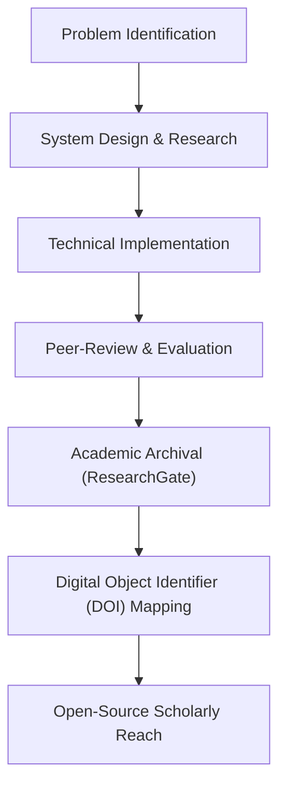

# Technical Specification: ResearchGate

## Architectural Overview

**ResearchGate** is a curated, scholarly archival architecture designed to systematically document, preserve, and showcase a diverse range of technical research projects spanning across the fields of **Computer Science and Engineering**. The project serves as a comprehensive academic repository, bridging the gap from theoretical system design to functional technical implementations and peer-reviewed scholarly publications.

### Scholarly Archival Flow

---

## Technical Implementations

### 1. Multi-Language Research Engines
-   **Computational Logic**: Utilizes **Python** for machine learning (Bangalore House Price Prediction), **Java** for core application logic (Hangman), and **Julia** for high-performance numerical summarization.
-   **Web Engineering**: Implements **PHP**, **HTML/CSS**, **JavaScript**, and **AJAX** to build responsive, database-driven scholarly interfaces and chat systems.

### 2. Research Modules & Frameworks
-   **Machine Learning**: Deploys **`scikit-learn`** and **`pandas`** for exploratory data analysis and **`tensorflow.js`** for browser-based deep learning (White-Box Cartoonization).
-   **Deep Learning Frameworks**: Integrates **Generative Adversarial Networks (GANs)** for image processing and **Reinforcement Learning** for stock market optimization strategy development.
-   **Natural Language Processing**: Proposal and implementation of summarization models and interactive chatbots using **Amazon Lex**.

### 3. Scholarly Compliance System
-   **Academic Archival**: The repository structures formal research artifacts including **Published Articles**, **Technical Reports**, **Preprints**, and **Presentation Material**.
-   **Citation & Identifiers**: Integrates **`CITATION.cff`** and **`codemeta.json`** metadata protocols, mapping projects to unique **Digital Object Identifiers (DOIs)** for scholarly reference.

---

## Technical Prerequisites

-   **Runtime**: Python 3.x, Java Runtime Environment (JRE), PHP web server (Apache/Nginx).
-   **Development**: Jupyter Notebook, AWS Console (for Lex bots), and standard IDEs (VS Code, IntelliJ).
-   **Dependencies**: PDF viewer for technical reports and academic articles.

---

*Technical Specification | ResearchGate | Version 1.0*
